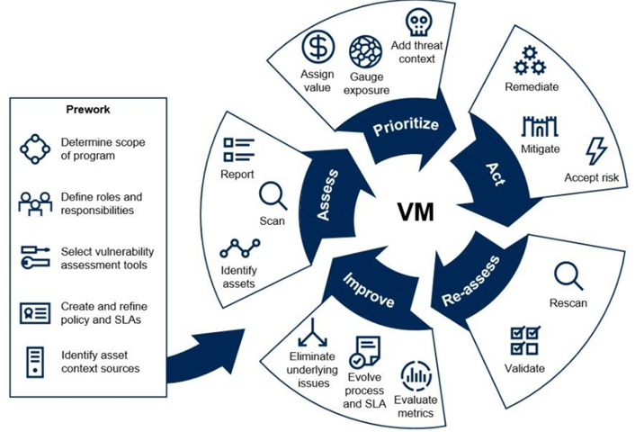

VMO NOTES - BLOCK 1
===================

Contents
--------

> Insights

> L1 - Vulnerability Scanning

> L2 - Orders Process

> L3 - Generalized Troubleshooting Concepts

---

 

## Insights

> - 

---

 

## L1 - Vulnerability Scanning

> - Goals
>   - Differentiate scanning for Vulnerability vs Compliance
>       - Vulnerability: Inspection of potential exploits to identify security holes
>       - Compliance: Ensures system configuration complies to security policy controls
>       - Difference: Vuln. scans inspects systems for exploits, Comp. scans check security policy compliance
>   - Differentiate Detection vs Remediation
>       - Detection: Used in the identification & detection of vulnerabilities due to misconfiguration or flawed programming within a network-based asset
>       - Remediation: Mitigates risk to the AFIN via the implementation of vulnerability countermeasures
>       - Difference: Detection finds vulnerabilities, which Remediation then attempts to fix
>   - Identify active scans
>       - Active scans prompt a system for information, such as system config or open ports, or test vulnerabilities by performing known attacks against a system. There is a potential for a high yield of information, but these scans are high-cost and can lead to system down-time, with the risk of an improperly configured scan or system resulting in an inaccurate scan. They are best used during non-working hours or by specific demand.
>   - Differentiate Credentialed vs Non-Credentialed scans
>       - Credentialed: Use of priviledged access to perform a scan on a system, with higher-privilege access yielding more in-depth information
>       - Non-Credentialed: Assessment of a system without system privileges, scanning exposed services for outward-facing vulnerabilities. These scans can slow or halt service on the target.
>       - Difference: Credentialed scans use privileged information to perform a more effecient, targetted scan of a system, while Non-Credentialed scans can perform a scan without privileged access at the cost of lower yield of information and potential disruption of resources

> - Vulnerability Management
>   - Vulnerability Management Cycle  
>         
>     - CSCS VMOs are responsible for the Assess & Re-assess steps
>   - Assessment & Authorization (A&A)
>       - Authorization required of scanning tools before use on AF assets.
>   - 16th AF directs use scanning solutions
>       - MPTO 00-33A-1109
>           - Assured Compliance Assessment Solution (ACAS)
>           - NOS/COSs Vulnerability Remediation threshold is 95% per enclave
>           - MECM

> - Vulnerability Scanning
>   - Assesses known weaknesses in endpoints, networks, & applications
>   - Creates an inventory of assets on the network
>   - Identifies OS versions, software, ports, & accounts/user activity

> - Compliance Scanning
>   - Enables high-level audits to identify & report weaknesses
>       - Audits enable system hardening
>   - Focusses on configuration & system hardening
>   - Checks adherence to compliance framework
>       - Examples
>           - Risk Management Framework (RMF DoD 8500)
>   - Audits OS configuration files
>       - OS specific; audits on unix machines use unix audit files
>   - Benefits of Compliance Scanning
>       - Provides assurance that compliance regulations are being satisfied
>       - Identifies gaps in compliance posture
>       - Reduces risks of fines and lawsuits

> - Vulnerability Detection
>   - Designed for two methods of testing
>       - Static analysis of code (source or binary)
>       - Penetration testing of live system
>   - Creates a catolog of software fault patterns (CVEs)
>   - Identifies signature detection - learned behaviors/user baseline
>   - Bug vs Flaw - Software Development Life Cycle (SDLC)
>       - Bugs
>           - Buffer overflows, SQL injections
>       - Flaws
>           - Broken access control, logic violations
>   - Categories of Vuln. Detection - Based on assets scanned
>       - Network-based scans
>       - Host-based scans
>           - Direct, physical access scan of a client
>       - Wireless scans
>           - Check configuration and identify rogue APs
>       - Application scans
>       - Database scans

> - Vulnerability Remediation
>   - Workflow for fixing or neutralizing detected weaknesses
>   - 4 steps
>       1. Find - Detect vulnerabilities via scanning & testing
>       2. Prioritize - Understanding which vulnerabilities pose the greatest risk
>           - NIST Common Vulnerability Scoring System (CVSS)
>               - Scores vulnerabilities based on risk with a rating & a score
>               - Critical (CVSS 9-10)
>                   - Create action plan within 2 weeks
>                   - Remediate within 1 month
>               - High (CVSS 7-8.9)
>                   - Create action plan within 1 month
>                   - Remediate within 3 months
>               - Other
>                   - May be resolved with discretion based on availability of resources
>       3. Fix - Patch, block, fix vulnerabilities at scale in real time
>       4. Monitor - Continuous, automatic monitoring w/ real-time alerts

> - Active Scans
>   - Any scan currently configured to run, be it scheduled or on demand
>   - Approach includes everything an organization does to hinder system breaches
>       - Requires continuous monitoring
>           - Examine responses to evaluate whether a node represents a weak point
>   - Actively prompts a system for information
>   - IAW MPTO 00-33A-1109 on Active Scans
>       - An Active Scan object will have its Max Scan Duration (hours) set to 20, without exception
>       - Any old or unused scans are deleted quarterly

> - Credentialed & Non-Credentialed Scans
>   - Credential-based
>       - Uses the admin account to do a more thorough check by finding problems that can't be seen from the network
>       - Maintaining an accurate list of credentials is difficult
>   - Non-credentialed
>       - Gives you a quick look at vulnerabilities by only looking at network services exposed by the host, but don't provide deeper insight into OS and application vulnerabilities that don't face the network
>   - IAW MPTO 00-33A-1109 on Credentialed/Non-Credentialed Scans
>       - Credentialed scan using on-site Nessus Scanners or a Nessus Network Monitor (NNM) to identify all live hosts, IP addresses & ranges within an enclave, and quickly checking authenticated access w/ provided credentials
>       - Non-Credentialed DMZ device scans with Critical/High severity findings will be subject to quarantine and/or removal

> - VMO CSCS Tools
>   - ACAS (Assured Compliance Assessment Solution)
>   - ARAD (Automated Remediation Asset Discovery)
>   - MECM (Microsoft Endpoint Configuration Manager)

---

 

## L2 - Orders Process

> - 

---

 

## L3 - Generalized Troubleshooting Concepts

> - 